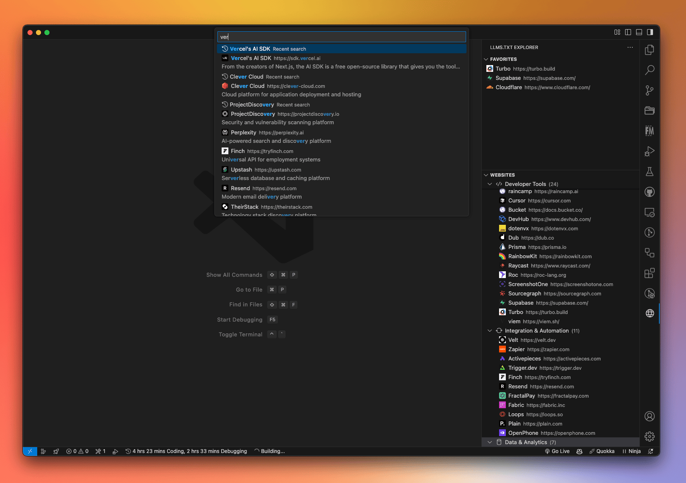

# LLMS.txt Explorer for VS Code

  

  

  

A VS Code extension that simplifies browsing, searching, and managing LLMS.txt files from various websites. Access and view LLMS.txt content directly within your editor, making it easier to understand how different websites interact with AI language models.

## Installation

1. Open VS Code
2. Open the Extensions view from the Activity Bar
3. Search for "LLMS.txt"
4. Click Install

## Features

- **🌐 Browse Websites**: View a categorized list of websites that provide LLMS.txt files
- **🔍 Smart Search**: Quick search with fuzzy matching and search history
- **📂 Category Management**: Filter websites by category
- **⭐ Favorites**: Mark and quickly access your favorite websites
- **📋 Quick Copy**: Easily copy LLMS.txt and LLMS Full.txt URLs
- **👀 Content Preview**: View file contents directly in VS Code
- **🔄 Auto-refresh**: Keep your website list up to date

## Usage

### Available Commands

- **Search Websites**: Quick search through all websites
- **Filter by Category**: Filter websites by their category
- **Clear Category Filter**: Remove category filtering
- **Refresh Websites**: Update the website list
- **Copy LLMS.txt URL**: Copy the URL of a website's LLMS.txt file
- **Copy LLMS Full.txt URL**: Copy the URL of a website's LLMS Full.txt file
- **View Content**: Open and view the content directly in VS Code
- **Visit Website**: Open the website in your default browser
- **Add/Remove Favorites**: Manage your favorite websites

### Context Menu Actions

Right-click on any website to access:
- Copy URL options
- View content options
- Add/Remove from favorites
- Visit website

## Configuration

The extension can be customized through VS Code settings:

- `llms-txt.general.autoRefreshInterval`: Control how often the website list refreshes
- `llms-txt.general.maxSearchHistory`: Set the number of recent searches to remember
- `llms-txt.view.defaultExpandedCategories`: Control whether categories are expanded by default
- `llms-txt.view.showFavicons`: Toggle website favicon display

## Development

### Prerequisites

- Node.js (v14 or higher)
- npm (v6 or higher)
- VS Code

### Setup

1. Clone the repository
2. Run `npm install`
3. Open in VS Code
4. Press F5 to start debugging

## Contributing

Contributions are welcome! Please feel free to submit a Pull Request.

## License

This project is licensed under the MIT License - see the [LICENSE](LICENSE) file for details.

## Acknowledgements

- Data source: [LLMS.txt Hub](https://github.com/thedaviddias/llms-txt-hub)
